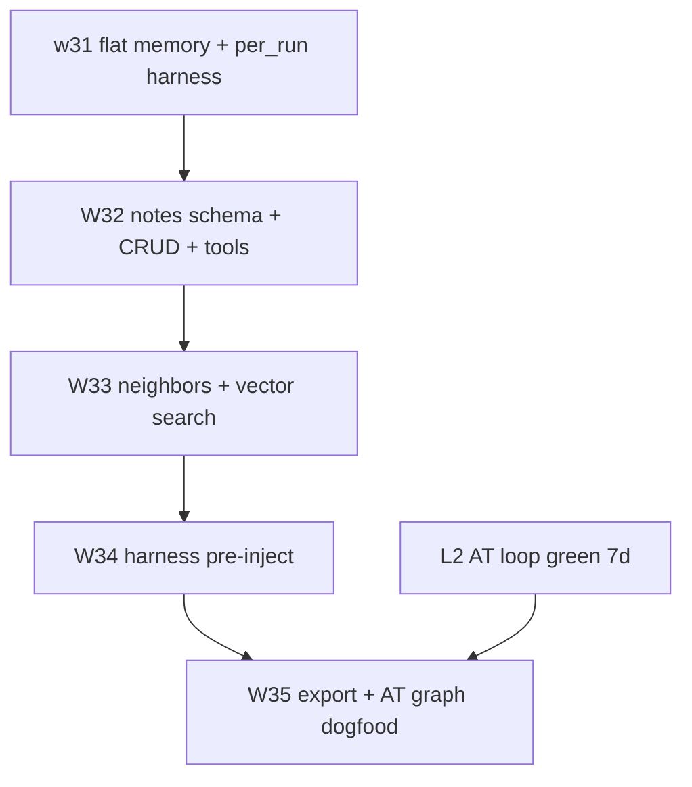

# Development plan — Memory graph & lanes

**Positioning:** Orbita = **Agent System Backend** — HTTP agent runtime for AI callers and low-coupling application backends. Memory graph is **additive** to flat `client_memories`; it does not replace it.

**Design reference:** Book chapter on memory (`usr/memory-design-from-book.md`) — retrieval is the bottleneck; memory is infrastructure (harness inject), not agent habit.

---

## Wave roadmap (W32–W35)

| Wave | Deliverable | Depends on |
|------|-------------|------------|
| **W32** | `notes` + `note_links` schema; `PUT/GET /v1/notes`; tools `note_put`, `note_get`, `note_link` | w31 flat memory ✅ |
| **W33** | `GET /v1/notes/{id}/neighbors` (graph traverse); `GET /v1/notes/search` (vector); `getNoteContext()`; tool `note_search` | W32 ✅ |
| **W34** | Harness pre-inject config (`memory_keys`, `graph_from`, `depth`, `vector_query`) | W33 |
| **W35** | Export `.md` + wikilinks; AT1b dogfood (rubric note ↔ rejected draft edges) | W34 + L2 green |

### W32 schema (Postgres only)

```text
notes:
  id uuid PK
  client_id text NOT NULL
  title text
  body text NOT NULL
  frontmatter jsonb DEFAULT '{}'
  embedding vector(1024)
  created_at, updated_at timestamptz

note_links:
  client_id text NOT NULL
  from_id uuid → notes(id) ON DELETE CASCADE
  to_id uuid → notes(id) ON DELETE CASCADE
  rel text NOT NULL
  created_at timestamptz
  UNIQUE (client_id, from_id, to_id, rel)
```

**Coexistence:** Flat memory for small JSON/state keys; notes for long prose, YAML frontmatter, and graph edges.

### W33–W35 (planned)

- **W33:** BFS/depth-limited neighbor walk + pgvector search on `notes.embedding`; combine into `getNoteContext()` for turns.
- **W34:** Harness `config.memory_inject` — platform pulls keys + graph slice before agent turn (book: "memory as infrastructure").
- **W35:** `GET /v1/notes/export` → Obsidian-friendly `.md`; AT1b links editorial rubric notes to rejected drafts.

---

## Four lanes (summary)

See **`docs/DEVELOPMENT_LANES.md`** for the live lane table.

| Lane | Focus | Now |
|------|-------|-----|
| **L1 Platform** | Harness, memory, API | W33 ✅; W34 harness pre-inject next |
| **L2 AT dogfood** | Closed editorial loop | **PRIMARY** — poll sync ✅ after review |
| **L3 GTM/MA** | AI Business Life | ⏸️ after L2 green 7 days |
| **L4 Ops** | Deploy, docs | Sync plan + deploy on platform waves |

```text
L1 (W32–W35) ──► richer memory for L2 feedback loop
L2 (supply 07:00 + poll 18:00 UTC) ──► dogfood proof ──► L3 case study
L4 ──► deploy + docs on each platform wave
```

---

## L2 — AT1b editorial loop

```text
07:00 UTC  Supply harness (editorial-supply@v1, session_policy: per_run) → ~5 drafts/day
     ↓
Human      /editorial review
     ↓
18:00 UTC  Poll harness → editorial/feedback memory
     ↓
Next supply reads feedback
```

| Resource | ID |
|----------|-----|
| Supply harness | `dd839025-1200-4df4-b69b-b3454625416f` |
| Poll harness | `e4c0de60-9db6-4bb8-9845-b5c586afcc36` |
| API | `https://api.get-orbita.com` |

Shell scripts under `at-agent/` are **bootstrap/fallback only**; steady state is agent-initiated harness cron.

---

## Dependency graph



---

## Parallel work matrix

Safe to run in parallel:

| Stream | Owner | Blocks |
|--------|-------|--------|
| **A** User `/editorial` + AT UI improvements | Human + AT | Nothing on Orbita |
| **B** W32–W33 memory graph (Orbita code) | Platform | W34 until W33 done |
| **C** Docs sync (`CURRENT_STATUS`, lanes) | Platform | Nothing |

**Deferred (off radar):** H2/H3 auto-improve · W15 multi-user · W17 billing · AT webhooks Phase 2 · X publish

---

## Current prod target

- API version: **0.0.1-w32** (after W32 deploy)
- Previous: **0.0.1-w31** — `session_policy: per_run`, `GET /v1/memories/{key}`

---

## Success criteria

| Milestone | Signal |
|-----------|--------|
| W32 | Notes CRUD + tools in prod; migration idempotent |
| W33 | Hybrid retrieve returns linked rubric + similar notes |
| W34 | Harness run injects graph without agent calling `note_get` |
| W35 | AT1b rejection reasons linked in graph; export opens in Obsidian |
| L2 green | 7 consecutive days: supply + poll + feedback consumed |
