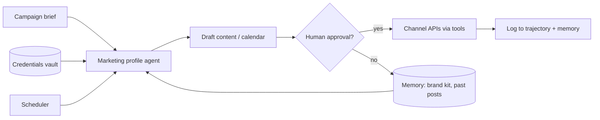

# Marketing agent (potential use case)

**Status:** Draft idea · **not implemented**

Orbita could act as a **marketing and promotion agent** that helps grow your projects across channels (social, ads, SEO, email, etc.). This document captures what that would mean in terms of **credentials**, **skills**, **tools**, and **product boundaries** — without committing to any platform or implementation wave.

---

## 1. Problem statement

You have one or more products (repos, SaaS, content sites). Promotion is repetitive and multi-channel:

- Draft posts tailored to each platform’s format and audience
- Maintain consistent brand voice
- Schedule recurring content or reports
- Optionally publish or run campaigns when approved

Orbita is already **agent-first** (sessions, tools, memory, scheduler, credentials vault). A marketing use case maps cleanly onto existing lanes; it mainly needs **profile + skills + channel credentials + guardrails**, not a new product shape.

---

## 2. High-level flow

**Default posture:** **draft-first**. The agent proposes content; a human (or webhook approval step) authorizes anything that mutates the outside world (posts, ads, spend).

---

## 3. What maps to Orbita today

| Orbita capability | Marketing use |
|-------------------|---------------|
| **Agent profiles** (`default`, `research`, `coding`) | Add `marketing` profile with channel-specific system context |
| **Skills** (markdown guides) | Brand voice, per-channel rules, compliance |
| **Credentials vault** | OAuth tokens / API keys per channel, scoped by `client_id` |
| **HTTP tools** (`http_get`, `http_post`) + allow-list | Call channel REST APIs where no dedicated tool exists |
| **Memory** | Brand kit, product facts, campaign state, “what we already posted” |
| **Scheduler** | Weekly content calendar, daily engagement check, monthly SEO report |
| **Trajectory** | Audit trail of drafts, approvals, and publishes |
| **Admin console** | Store credentials, manage API keys per marketing `client_id` |

**Out of scope (by design):** browser automation, scraping behind logins, or “drive the ads UI” — same as current Orbita boundaries.

---

## 4. Example channels (illustrative)

These are **examples** to illustrate credential and tool needs. We do not need all of them for an MVP.

| Channel | Typical goal | Credential type | Risk if auto-published |
|---------|--------------|-----------------|------------------------|
| **X (Twitter)** | Short posts, threads | OAuth 2.0 / API v2 keys | Reputation, rate limits |
| **LinkedIn** | Professional posts, company updates | OAuth (page/org) | Brand / compliance |
| **Reddit** | Community engagement | OAuth app + refresh | Subreddit rules, bans |
| **TikTok** | Short video promotion | Business / Marketing API | Format mismatch, policy |
| **Google Ads** | Paid campaigns | OAuth + customer ID | **Spend**, targeting errors |
| **Google SEO** | Rankings, Search Console | OAuth (read) + optional CMS key | Low if read-only; higher if CMS publish |
| **Blog / CMS** (WordPress, Webflow) | Long-form, landing pages | API key | Wrong publish, SEO damage |
| **Email** (Resend, SendGrid) | Newsletters | API key | Spam, list compliance |
| **Analytics** (GA4, Plausible) | Performance reports | Read-only token | Low (read) |

**LLM keys** (Anthropic, MiniMax, etc.) stay **deployment environment variables**, not per-user vault entries — same split as today.

---

## 5. Credentials vault layout

One **caller `client_id`** per marketing context (e.g. `marketing-myproduct`):

| Vault entry `name` | Example scopes | Used for |
|--------------------|----------------|----------|
| `x_api` | `tweet.write` | Posting to X |
| `linkedin_org` | `w_organization_social` | Company page posts |
| `reddit_app` | `submit`, `read` | Subreddit posts (careful) |
| `google_ads` | `adwords` | Campaign changes (high risk) |
| `search_console` | `webmasters.readonly` | SEO reports |
| `cms_wordpress` | `posts` | Blog publish |
| `resend` | `emails:send` | Newsletter send |

Store via `POST /v1/admin/credentials` (admin) or admin UI. Agent resolves secrets at tool runtime for the session’s `client_id`.

HTTP allow-list in admin settings must include each channel’s API host (e.g. `api.twitter.com`, `api.linkedin.com`).

---

## 6. Skills (markdown behavior guides)

Skills are **not** executable code; they steer the agent. Suggested files under a future `skills/marketing/` tree:

| Skill file | Purpose |
|------------|---------|
| `brand-voice.md` | Tone, taboo topics, product one-liners, competitor mentions |
| `channel-x.md` | Length limits, hashtags, thread structure |
| `channel-linkedin.md` | Professional tone, CTA patterns |
| `channel-reddit.md` | Value-first, no spam, subreddit etiquette |
| `seo-brief.md` | Keyword intent, titles, meta, internal links |
| `compliance.md` | `#ad`, financial disclaimers, regulated industries |
| `content-calendar.md` | How to plan weekly themes and reuse angles |

The **`marketing` agent profile** would load a subset of these (similar to how `research` loads research-oriented context).

---

## 7. Tools

### Tier A — available now

| Tool | Marketing use |
|------|---------------|
| `echo` / mocks | Tests, E2E |
| `http_get` | Fetch analytics, Search Console exports, public APIs |
| `http_post` | Post to channels with REST APIs (after allow-list + approval) |
| Memory read/write | Brand kit, campaign notes, post history |
| Scheduler | Trigger recurring “draft Monday thread” sessions |

### Tier B — likely next (dedicated wrappers)

Typed tools reduce foot-guns vs raw HTTP:

| Tool | Why wrap |
|------|----------|
| `channel_post_x` | Validate length, media attachments, error mapping |
| `channel_post_linkedin` | Org vs personal, document posts |
| `seo_report` | Normalize Search Console + on-page checks |
| `draft_only` | Write to memory with `status: pending_approval` — no external call |

### Tier C — product / workflow

| Feature | Role |
|---------|------|
| **Approval webhook** | Agent emits `pending_post`; external system or admin approves; second turn publishes |
| **Rate limits per key** | Already on API keys; important for burst posting |
| **Sandbox profile** | Draft-only, no `http_post` to publish hosts |

---

## 8. Suggested MVP (if we implement later)

Smallest slice that proves value without high risk:

1. **`marketing` profile** + `brand-voice.md` + one channel skill (e.g. X or LinkedIn).
2. **Credentials** for that one channel in vault.
3. **Draft-only mode:** agent returns structured JSON (post text, hashtags, suggested time); writes to memory; **no auto-publish**.
4. **Scheduler:** weekly job — “generate 3 post ideas for product X”.
5. **Manual publish:** human copies draft or triggers a second approved session with `http_post`.

Only after that: approval webhook + one `channel_post_*` wrapper + optional CMS/SEO read tools.

---

## 9. Open questions

| Question | Options |
|----------|---------|
| One agent per product or one agent per channel? | Single `client_id` with skills vs split keys |
| Where does approval live? | Admin UI button, Slack webhook, email link |
| Multi-user (W15+)? | Each user’s products vs shared org brand kit |
| Hosted SaaS vs self-host only? | See `docs/api-as-product.md` |
| Image/video generation? | External API keys (DALL·E, etc.) as vault entries; storage via R2 later |

---

## 10. Non-goals (for this use case)

- Replacing full marketing suites (HubSpot, Hootsuite) in v1
- Autonomous ad spend without human approval
- Browser-based “post like a human” automation
- Real-time social listening at scale (unless via official APIs + budget)

---

## 11. References

- `docs/product-architecture.md` — lanes, waves, agent-first API
- `docs/self-host.md` — credentials, admin, profiles
- `docs/admin-ui-brainstorm.md` — admin vs caller keys
- `usr/ORBITA_DESIGN.md` — HTTP tools, no browser automation
